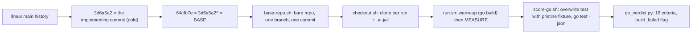

# The instrument repaired, and the subject changed: 2026-08-16

**Two things settled here, and the second one supersedes most of what round 2 and the night of the 15th left open.**

1. **The deepseek lane's output ceiling is fixed**, on the wire and in a real run. [`round-2.md`](round-2.md) concluded that raising the limit was not an available move; that conclusion was wrong and is corrected there and here.
2. **`arch-42q` is retired as the benchmark's subject.** The subject is now `llmux`, bead `llmux-p4-two-phase-reservation-5vg`, graded by sixteen test functions instead of five criteria.

## The output ceiling, and why the earlier reading was wrong

The symptom that killed `deepseek-max-01` was never in doubt: one turn spent 65 536 output tokens, 61 104 of them reasoning, stopped at `length`, and the run ended having committed nothing. What was wrong was the conclusion drawn about it - that the limit the harness asks for is unreachable, so the lane can only produce failed runs.

The mechanism, each link checked rather than inferred:

| link | evidence |
|---|---|
| Ollama's OpenAI endpoint reads `max_tokens` only | its own documentation lists `max_tokens`; `max_completion_tokens` appears nowhere in it. `ollama#7125` has been open since October 2024 and its PR is unreviewed |
| `pi` sends `max_completion_tokens` | `pi-ai/dist/api/openai-completions.js:535`; `detectCompat` returns `maxTokensField: "max_completion_tokens"` for any base URL it does not recognise |
| LiteLLM does not rename it on this route | the rename exists in the `openai_like` transformation, not in the `openai/` one, which lists both fields and passes them through |
| the provider's hard ceiling is 65 536 | measured on this account: `max_tokens (99999999) exceeds model's maximum output tokens (65536)` |
| `pi` could not recover from the cut | its recovery test requires `usage.output < declared`, and the catalog declared 32 000 against a 65 536 cut, so the truncation was classified as unrecoverable |

So the field is sent, under a name the provider does not read. That is a different fault from "the parameter is discarded", and it has an obvious fix: set the limit at the proxy, where the request is already being rewritten.

**What was changed.** `max_tokens: 32000` on the nine deepseek anchors in the proxy configuration, and `maxTokens: 65536` on the six deepseek entries in the agent's model catalog. **The gap between the two numbers is load-bearing rather than sloppy:** recovery requires the observed output to be below the declared maximum, so a cut at 32 000 under a declared 65 536 is recoverable and the session compacts and continues. Equal values would bound the spiral and still end the run.

**What was rejected.** Lowering `reasoning_effort` from `max` to `high`. The run's own data does not support it: thirty-seven turns ran at a median of 133 reasoning tokens and the thirty-eighth spent 61 104. Effort amplifies a spiral, it does not start one, and lowering it leaves the hole open for the next lane that finds it. Effort stayed at `max`.

**Verified twice, once on the wire and once in a run.** `max_tokens: 5` against a prompt asking for a long answer returned `finish_reason: length` at exactly 5 completion tokens; `max_tokens: 99999999` returned the 400 quoted above. Then `deepseek-max-04` was cut once, on its eighty-first assistant turn, at exactly `output: 32000` (`reasoning: 30770`), compacted, and ran 49 more turns. That is the same point at which `deepseek-max-01` had died.

The Kimi and GLM deployments were deliberately left uncapped. They carry the same exposure on paper, it has never been observed in practice, and they serve day-to-day work; the reason is recorded next to the asymmetry so it does not read as an oversight.

## The defect that had been destroying runs for weeks

While chasing the runs that kept dying after the ceiling was closed, the harness's own gate turned out to be rejecting sandboxes that were fine.

`verify.sh` sets `pipefail`, and its model check was written as `printf '%s\n' "$lane_models" | grep -qF "$needle"`. `grep -q` exits at its first match, the writer still has tens of kilobytes of catalogue to push, it takes SIGPIPE, and under `pipefail` the pipeline reports 141. **The gate reported the model missing precisely because it was found**, and it fired more often on a loaded machine, which is why it read for weeks as contention between concurrent runs.

Measured against the real gate, on a sandbox whose model demonstrably worked:

```
before:  4 false rejections in 10 runs
after:   0 in 10
```

Five sites carried the pattern and all five are fixed, each rewritten as a here-string or a bash pattern match. `evals/sandbox/verify.sh:41` is the one exception, marked `pipefail-safe` with its reason: it runs in a fresh `bash -c` inside the container, which never inherits `pipefail`.

`evals/test_pipefail_grep.py` is the regression guard. It scans every tracked shell file that sets `pipefail` and honours the marker, and it carries a second test asserting **that the defect still reproduces** - if that one ever passes, SIGPIPE no longer reaches the writer and the rule has become superstition. Both were proven able to fail by re-injecting the pattern.

**Two rewrites of the npm cache layout were spent on a race that does not exist**, before this was found. Worse, the concurrency test written to verify the third attempt carried the identical `pipefail` bug, so both the reproduction and the verification were measuring the test rather than the harness. That work was discarded, and `sandbox.sh`, `run.sh` and `sweep.sh` now say so in comments so nobody re-derives the phantom.

## Why `arch-42q` is retired

Four independent lanes reached the same conclusion about it: the acceptance criteria cannot be met from inside the repository, because the layer the bead names lives inside the `spider` crate.

| lane | what it did |
|---|---|
| `deepseek-max-01` | spiralled arguing the point, and died in the spiral |
| `deepseek-max-04` | stopped after 131 turns to ask *"Shall I proceed with Option 1?"* |
| `glm52`, three runs | returned `no-diff`, each arguing the same objection |
| `sonnet-01` | 49 turns, wrote that the literal acceptance criteria cannot be met from inside this project as currently scoped, and offered three ways forward |

Against that, the only clean pass took over link discovery, which is a placement decision rather than a fix, and one earlier pass had patched the crate in the machine's own registry.

**The alternative was to keep the bead and grade the placement judgement.** It was rejected because no acceptance criterion can separate a fix from a circumvention here, and the instrument has already been poisoned once through exactly that path.

`arch-3ff` was considered as a replacement and rejected without running: its own body records that no acceptance criteria exist and none can be written until two blocking decisions are made. Same disease, caught before spending anything.

**`FROZEN.md` still applies.** The two `archeion` branches it protects remain the evidence for what the pilot and round 2 produced, and retiring the bead as a *subject* does not make them disposable.

## The new subject, and how the task was cut

Subject: `llmux`, a Go repository. Bead: `llmux-p4-two-phase-reservation-5vg`.

**The base is the parent of the commit that implemented the bead**, not a hand-made revert. That is how SWE-bench builds a task, and a revert produces a tree that never existed. The implementing commit is the gold patch, never shown to the agent; its only job is proving the task solvable.



The ladder was proven before a token was spent:

```
base  64cfb7e   0/16   build_failed: true   (the package does not compile - that IS the contract)
kimi  62bf722  16/16   committed, 1 file, +119 lines
gold  3d6a5a2  16/16
```

### The bead named in the plan is not the bead used

`llmux-p4-in-flight-leases-0t1` looks like the right P0 and is not. Its content was delivered by `3d6a5a2`, which is `5vg`'s commit; no commit names `0t1`, and the vendored tests are `5vg`'s. Giving a run one statement and grading it by another would be an instrument fault, so the bead used is `5vg`.

### The verification is API-shaped, deliberately

The vendored test dictates ten identifiers (`Reserve`, `PendingLease`, `Finalize`, `Release`, `Reserved`, `SkippedBlackout`, `SkippedDisabled`, `SkippedGate`, `SkippedInFlightSaturated`, `SkippedRateSaturated`). The alternatives were a black-box end-to-end test, which the proxy has no path for at base, or picking another bead and restarting selection.

A refinement made the cost zero: **the test file is already in the base tree**, so the contract reaches the agent through the failing test and nothing had to be added to the prompt.

### A build failure is graded as all criteria false

This bead's base does not compile, so a build failure is both the starting state and the shape of a near-miss: a working solution under different names fails exactly the same way. Recording it as unscored would drop the hardest cases out of the denominator.

### Selection filters, one of them added by the pilot

1. the canonical verification fails on the base;
2. the base is otherwise green;
3. the failure is an assertion rather than a compile error - **relaxed deliberately for `5vg`**, where the failing compile is the contract;
4. *added after the pilot* - the cheapest lane must not pass on the first attempt.

An earlier candidate was rejected by none of these and by something worse: a vendored test patch that was red on base and green on base-plus-fix, but failed to **compile**, because it called a private signature the fix introduced. That is a test measuring name-guessing, not behaviour.

## What `5vg` is for, and what it is not

The cheapest lane passed 16 of 16 on its first attempt in four minutes, which by filter (4) disqualifies `5vg` as a difficulty measurement. **It is kept anyway, and on purpose.**

Resolve rate is not the only metric this experiment needs, and it is the one that has been at ceiling since the first task. What has never been measured cleanly is **what a completed bead costs**: wall clock, turns, tokens, price per lane. That measurement needs the opposite of a hard bead - it needs one **every lane can finish**, so that each lane produces a completed unit and the comparison is between costs rather than between failure modes. A bead only two lanes solve gives two data points and four excuses.

So `5vg` is the **cost bead**. A harder bead, selected with the four filters and sitting in the 30 to 70 percent band, is the separate instrument for the capability question, and comes after.

Its other property matters here: the base does not compile, so a lane that produces plausible code under the wrong names lands at 0 of 16 rather than partway up. The graded verdict still discriminates, it just discriminates on naming as well as behaviour.

## The claude lane

Added this round. It launches through `claude-as <account>`, never bare `claude`: file authentication holds one account at a time, so a bare launch runs against whichever account that file happens to carry, starts normally, and attributes the run to the wrong subscription. `AGENT_SCOPE=1` suppresses the wrapper's own scope unit, which has no session bus inside the jail, at the cost of losing its memory cap.

Its pre-flight proves the account's token arrived, rather than pretending to check a model catalogue that cannot be listed for free. The collector dispatches on the lane name, because the Claude envelope also carries a `usage` dictionary and the agy reader would parse it happily and return a record wrong in the shared fields and empty in the rest.

**`total_cost_usd` is recorded as `list_price_usd_not_paid`.** The lane authenticates with a subscription token, so that figure describes the API bill for the same traffic, not this run's cost. A four-token reply reported US$ 0.20, which is the clearest possible demonstration of why the field needed a different name.

## The runs this round produced

| run | lane | subject | outcome |
|---|---|---|---|
| `deepseek-max-02` | deepseek-v4-pro-max, k1 | `arch-42q` | 429 after 189 turns and 63 minutes, no diff |
| `deepseek-max-04` | deepseek-v4-pro-max, k3 | `arch-42q` | recovered from the truncation, stopped after 131 turns to ask permission, no diff |
| `sonnet-01` | claude, sonnet | `arch-42q` | 49 turns, no diff, argued the bead |
| `llmux-kimi-02` | kimi-k2.7, k2 | `5vg` | **16/16, committed**, 41 turns, 4 min 23 s |

`deepseek-max-03` never started: its supervisor was killed before it launched. **Runs are launched with `setsid nohup`** from now on, because a killed wrapper takes `run.sh` with it, and it did so twice.

Three concurrent runs of one lane is also settled: `deepseek-max-02` died on a 429 after 63 minutes with another account live. The rate ceiling is per account, so one run per account.

**`deepseek-max-02`'s `verdict.json` and `record.json` were rebuilt by hand** from the files on disk after its supervisor was killed mid-scoring. The numbers are real; the provenance differs from every other run's, which matters if that row is ever quoted.

## Open

- ~~**The cost measurement itself.**~~ **Done, five arms of five runs**, in [`five-arms-2026-08-16.md`](five-arms-2026-08-16.md). Repairing the scorer while doing it changed the answer for one arm from four passes to zero, and turned up the first real discrimination this bead has shown: one lane deletes pre-existing public API in every run and the other four never do.
- **A harder bead**, selected by the four filters over `llmux`'s implementation-plus-test commits, for the capability question that `5vg` deliberately does not answer.
- **The per-account request ceiling**, still unmeasured. One data point: k1 sustained 63 minutes and 189 turns of heavy use, with another account live, before a 429.
- **`ricebench`**, also Go, never examined as a source of candidates.
- **The qualitative half of the rubric** ("was this the right layer?"), never exercised, because no lane had passed a well-specified bead until this round.
